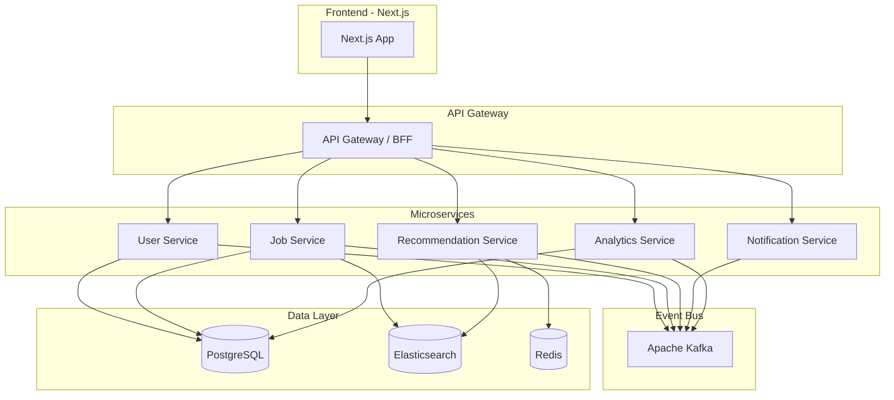

# Scalable Event-Driven Job Matching System

> A production-grade mini LinkedIn Jobs backend + frontend with intelligent matching, event-driven architecture, and real-time analytics.

## User Review Required

> [!IMPORTANT]
> **Technology Choices** — This plan uses **Node.js (Express/Fastify)** for backend microservices instead of Java/Spring Boot. Node.js allows us to share code between frontend and backend, iterate faster, and keep the stack consistent. If you strongly prefer **Java (Spring Boot)**, let me know and I'll adjust.

> [!IMPORTANT]  
> **Scope & Phasing** — This is a very large project. I've divided it into **6 phases** so we can build incrementally. Each phase delivers working, testable functionality. Please confirm whether you want me to build **all phases** or start with a specific subset.

> [!WARNING]
> **Infrastructure Dependencies** — Kafka, Elasticsearch, Redis, and PostgreSQL will run via **Docker Compose**. You'll need Docker Desktop installed. If Docker is unavailable, I can provide mock/in-memory alternatives for development.

---

## Architecture Overview



---

## Tech Stack

| Layer | Technology | Purpose |
|-------|-----------|---------|
| **Frontend** | Next.js 14 + React | UI, SSR, API routes |
| **Styling** | Vanilla CSS with custom design system | Premium, modern aesthetics |
| **API Gateway** | Express.js (custom) | Routing, auth, rate limiting |
| **User Service** | Node.js + Express | Auth, profiles, JWT |
| **Job Service** | Node.js + Express | CRUD, search, listings |
| **Recommendation Service** | Node.js + Express | TF-IDF matching, scoring |
| **Notification Service** | Node.js + Express | Email, push alerts |
| **Analytics Service** | Node.js + Express | CTR, conversions, tracking |
| **Event Bus** | Apache Kafka | Event-driven messaging |
| **Primary DB** | PostgreSQL 16 | Structured data |
| **Search Engine** | Elasticsearch 8.x | Full-text search, matching |
| **Cache** | Redis 7 | Caching, rate limiting, sessions |
| **Containerization** | Docker + Docker Compose | Local orchestration |

---

## Proposed Changes

### Phase 1: Project Foundation & Infrastructure

Set up the monorepo structure, Docker infrastructure, and shared libraries.

---

#### [NEW] Root Project Structure

```
d:\project3\
├── docker-compose.yml              # All infrastructure services
├── docker-compose.dev.yml          # Dev overrides
├── .env.example                    # Environment template
├── package.json                    # Root workspace config
├── README.md
│
├── packages/
│   └── shared/                     # Shared types, utilities, constants
│       ├── src/
│       │   ├── types/              # TypeScript interfaces
│       │   ├── events/             # Kafka event schemas
│       │   ├── utils/              # Common utilities
│       │   └── constants/          # Shared constants
│       └── package.json
│
├── services/
│   ├── api-gateway/                # API Gateway service
│   ├── user-service/               # User & Auth service
│   ├── job-service/                # Job CRUD & Search
│   ├── recommendation-service/     # Job matching engine
│   ├── notification-service/       # Email/push notifications
│   └── analytics-service/         # Event tracking & metrics
│
├── frontend/                       # Next.js application
│
└── scripts/                        # Dev & deployment scripts
    ├── seed-data.js                # Database seeding
    └── setup.sh                    # First-time setup
```

#### [NEW] docker-compose.yml
Infrastructure services: PostgreSQL, Kafka (with Zookeeper), Elasticsearch, Redis, Kafka UI, and PgAdmin for development.

#### [NEW] packages/shared/
Shared TypeScript types, event schemas (Kafka), utility functions (JWT helpers, validation), and constants used across all services.

---

### Phase 2: Core Services (User + Job)

Build the two foundational microservices.

---

#### [NEW] services/user-service/
- Express.js REST API
- PostgreSQL database (users, profiles, skills)
- JWT authentication (access + refresh tokens)
- Endpoints: register, login, profile CRUD, skill management
- Publishes events: `user.registered`, `user.profile-updated`
- Database migrations with Knex.js
- Password hashing with bcrypt
- Input validation with Joi/Zod

**Key endpoints:**
| Method | Path | Description |
|--------|------|-------------|
| POST | `/api/auth/register` | Register new user |
| POST | `/api/auth/login` | Login, get JWT |
| POST | `/api/auth/refresh` | Refresh access token |
| GET | `/api/users/me` | Get own profile |
| PUT | `/api/users/me` | Update profile |
| GET | `/api/users/:id` | Get user public profile |
| PUT | `/api/users/me/skills` | Update skills |

**Database schema (users):**
```sql
CREATE TABLE users (
    id UUID PRIMARY KEY DEFAULT gen_random_uuid(),
    email VARCHAR(255) UNIQUE NOT NULL,
    password_hash VARCHAR(255) NOT NULL,
    role VARCHAR(20) DEFAULT 'candidate', -- candidate | recruiter | admin
    first_name VARCHAR(100),
    last_name VARCHAR(100),
    headline VARCHAR(255),
    bio TEXT,
    location VARCHAR(255),
    experience_years INTEGER DEFAULT 0,
    avatar_url VARCHAR(500),
    resume_url VARCHAR(500),
    is_active BOOLEAN DEFAULT true,
    created_at TIMESTAMPTZ DEFAULT NOW(),
    updated_at TIMESTAMPTZ DEFAULT NOW()
);

CREATE TABLE user_skills (
    id UUID PRIMARY KEY DEFAULT gen_random_uuid(),
    user_id UUID REFERENCES users(id) ON DELETE CASCADE,
    skill_name VARCHAR(100) NOT NULL,
    proficiency VARCHAR(20) DEFAULT 'intermediate', -- beginner | intermediate | expert
    UNIQUE(user_id, skill_name)
);
```

---

#### [NEW] services/job-service/
- Express.js REST API
- PostgreSQL for job listings, applications
- Elasticsearch integration for full-text search
- Filters: salary range, experience level, remote/hybrid/onsite, skills
- Publishes events: `job.created`, `job.updated`, `job.application-submitted`
- Syncs job data to Elasticsearch on write

**Key endpoints:**
| Method | Path | Description |
|--------|------|-------------|
| POST | `/api/jobs` | Create job (recruiter) |
| GET | `/api/jobs` | Search/list jobs |
| GET | `/api/jobs/:id` | Get job details |
| PUT | `/api/jobs/:id` | Update job |
| DELETE | `/api/jobs/:id` | Delete job |
| POST | `/api/jobs/:id/apply` | Apply to job |
| GET | `/api/jobs/:id/applications` | Get applicants (recruiter) |
| GET | `/api/applications/me` | My applications |

**Database schema (jobs):**
```sql
CREATE TABLE jobs (
    id UUID PRIMARY KEY DEFAULT gen_random_uuid(),
    recruiter_id UUID REFERENCES users(id),
    title VARCHAR(255) NOT NULL,
    company VARCHAR(255) NOT NULL,
    description TEXT NOT NULL,
    location VARCHAR(255),
    work_type VARCHAR(20) DEFAULT 'onsite', -- remote | hybrid | onsite
    salary_min INTEGER,
    salary_max INTEGER,
    currency VARCHAR(3) DEFAULT 'USD',
    experience_min INTEGER DEFAULT 0,
    experience_max INTEGER,
    status VARCHAR(20) DEFAULT 'active', -- active | closed | draft
    views_count INTEGER DEFAULT 0,
    applications_count INTEGER DEFAULT 0,
    created_at TIMESTAMPTZ DEFAULT NOW(),
    updated_at TIMESTAMPTZ DEFAULT NOW()
);

CREATE TABLE job_skills (
    id UUID PRIMARY KEY DEFAULT gen_random_uuid(),
    job_id UUID REFERENCES jobs(id) ON DELETE CASCADE,
    skill_name VARCHAR(100) NOT NULL,
    is_required BOOLEAN DEFAULT true,
    UNIQUE(job_id, skill_name)
);

CREATE TABLE applications (
    id UUID PRIMARY KEY DEFAULT gen_random_uuid(),
    job_id UUID REFERENCES jobs(id),
    user_id UUID REFERENCES users(id),
    status VARCHAR(20) DEFAULT 'submitted', -- submitted | reviewed | shortlisted | rejected | hired
    cover_letter TEXT,
    created_at TIMESTAMPTZ DEFAULT NOW(),
    updated_at TIMESTAMPTZ DEFAULT NOW(),
    UNIQUE(job_id, user_id)
);
```

---

### Phase 3: Event-Driven Architecture (Kafka)

Wire up the event backbone across all services.

---

#### [NEW] Kafka Event System
- Kafka producer/consumer wrappers in shared package
- Topics: `user-events`, `job-events`, `application-events`, `notification-events`, `analytics-events`
- Event schemas with versioning
- Idempotent consumers with event deduplication
- Dead-letter queues for failed events

**Event catalog:**
| Event | Topic | Producers | Consumers |
|-------|-------|-----------|-----------|
| `user.registered` | user-events | User Service | Notification, Analytics |
| `user.profile-updated` | user-events | User Service | Recommendation, Analytics |
| `job.created` | job-events | Job Service | Recommendation, Notification, Analytics |
| `job.updated` | job-events | Job Service | Recommendation |
| `job.viewed` | job-events | Job Service | Recommendation, Analytics |
| `application.submitted` | application-events | Job Service | Notification, Recommendation, Analytics |
| `application.status-changed` | application-events | Job Service | Notification, Analytics |

---

### Phase 4: Recommendation Engine & Caching

Build the intelligent matching system.

---

#### [NEW] services/recommendation-service/
- **TF-IDF based skill matching**: Convert user skills and job requirements into TF-IDF vectors, compute cosine similarity
- **Scoring algorithm** combining:
  - Skills match score (40%)
  - Experience level match (20%)
  - Location preference (15%)
  - Recency of posting (15%)
  - Popularity/CTR (10%)
- Redis caching of recommendations (TTL: 30 min)
- Kafka consumer: rebuilds recommendations on user/job events
- Elasticsearch queries for candidate ↔ job matching

**Key endpoints:**
| Method | Path | Description |
|--------|------|-------------|
| GET | `/api/recommendations/jobs` | Get personalized job recs |
| GET | `/api/recommendations/candidates/:jobId` | Get candidate recs for a job |

#### [MODIFY] Redis Caching Layer
- Cache search results (TTL: 5 min)
- Cache recommendation results (TTL: 30 min)
- Cache user sessions
- Rate limiting with Redis (sliding window)

---

### Phase 5: Notifications & Analytics

---

#### [NEW] services/notification-service/
- Kafka consumer for notification-triggering events
- Email notifications (using Nodemailer + templates)
- In-app notification storage (PostgreSQL)
- Notification preferences per user
- Events: new matching jobs, application updates, profile views

#### [NEW] services/analytics-service/
- Kafka consumer for all analytics events
- Track: job views, applications, click-through rates
- Aggregate metrics per job, per recruiter
- Time-series data for trends
- REST API for dashboard data

**Key analytics endpoints:**
| Method | Path | Description |
|--------|------|-------------|
| GET | `/api/analytics/jobs/:id` | Job-level metrics |
| GET | `/api/analytics/recruiter/dashboard` | Recruiter overview |
| GET | `/api/analytics/trends` | System-wide trends |

---

### Phase 6: Frontend (Next.js)

Build the premium, modern frontend.

---

#### [NEW] frontend/
Next.js 14 application with App Router.

**Pages:**
| Route | Description |
|-------|-------------|
| `/` | Landing page with search |
| `/jobs` | Job search + filters |
| `/jobs/[id]` | Job detail page |
| `/dashboard` | Candidate dashboard |
| `/dashboard/applications` | My applications |
| `/dashboard/recommendations` | Personalized recs |
| `/recruiter` | Recruiter dashboard |
| `/recruiter/jobs/new` | Post new job |
| `/recruiter/jobs/[id]` | Manage job + applicants |
| `/recruiter/analytics` | Analytics dashboard |
| `/auth/login` | Login page |
| `/auth/register` | Registration page |
| `/profile` | User profile page |

**Design System:**
- Dark theme with glass morphism effects
- Vibrant gradient accents (purple → blue → cyan)
- Smooth micro-animations (hover, loading, transitions)
- Bento grid card layouts
- Google Fonts (Inter for body, Outfit for headings)
- Responsive: mobile-first approach
- Custom CSS design tokens (no Tailwind)

---

## API Gateway

#### [NEW] services/api-gateway/
- Express.js reverse proxy
- JWT validation middleware
- Rate limiting (Redis-backed, sliding window: 100 req/min)
- Request logging
- CORS configuration
- Route aggregation to downstream services
- Health check endpoint

---

## Open Questions

> [!IMPORTANT]
> 1. **Backend Language**: Node.js (recommended for speed of development + code sharing with Next.js) or **Java/Spring Boot** (heavier but enterprise-standard)?

> [!IMPORTANT]
> 2. **Phases to Build**: Should I build all 6 phases, or start with a specific subset (e.g., Phases 1-3 for core backend, then add frontend)?

> [!NOTE]
> 3. **Email Provider**: For notifications, should I use a real provider (SendGrid, Resend) or mock emails with console logging for development?

> [!NOTE]
> 4. **Auth Provider**: Custom JWT auth (implemented here) or integrate with an external provider (Auth0, Clerk)?

> [!NOTE]
> 5. **Deployment Target**: Docker Compose for local dev only, or should I include Kubernetes manifests for production deployment?

---

## Verification Plan

### Automated Tests
- **Unit tests** for each service (Jest)
- **Integration tests** with Docker Compose (Testcontainers)
- **API tests** using Supertest/REST Client
- **E2E tests** via the browser tool for frontend flows

### Manual Verification
1. `docker-compose up` → all services start healthy
2. Register user → Login → Search jobs → Apply → See recommendations
3. Verify Kafka events flow through the system
4. Check Elasticsearch search accuracy
5. Verify Redis caching reduces response times
6. Test rate limiting works correctly
7. Frontend renders beautifully on desktop and mobile

### Performance Verification
- Search response time < 200ms (cached)
- Recommendation generation < 500ms
- Kafka event processing < 1s end-to-end
